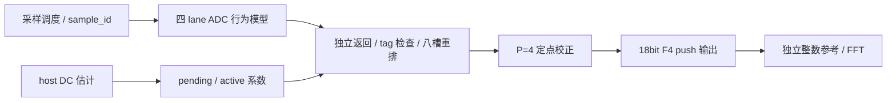

# 可运行实验：AD01–AD20

版本2026-10-04。源码见 [ADC实验目录](../../lessons/adc_digital/README.md)，实际工具结果见 [进度记录](../progress.md)。个人理解状态继续填 [学习表](08_workbook.md)，不会自动代填。

## 逐课实验入口

数值结果统一存`results/models/experiments.json`，含seed、参数、单位、各课记录和模型源文件SHA-256。某课有JSON记录不代表存在该课RTL/物理证据。

| 课号 | 可运行内容 | 源码与证据 |
|---|---|---|
| AD01 | 控制/数据/clock/配置/吞吐清单 | experiments.py架构记录，人工对照实际ADC |
| AD02 | 十次决策、全部1024码、比较迟到/超时/复位 | sar_controller + tb_architectures，RTL |
| AD03 | bubble/边界歧义、65536二值向量 | flash_encoder，模型+RTL |
| AD04 | residue恒等式、100份stage对齐及错标签 | pipeline_align，模型+RTL |
| AD05 | DWA均衡、静态单位误差、变量q/非法q | dwa_encoder，模型+RTL；动态DAC/环路未仿真 |
| AD06 | 四lane每25core周期调度 | ti_adc_backend，功能RTL；物理多相clock未实现 |
| AD07 | 不同/随机延迟、三通道同拍、槽环绕/故障 | ti_reference + tb_ti，独立台账+RTL |
| AD08 | 深度8、10/14ns异步域、满空/环绕/协调复位 | adc_async_fifo + tb_fifo；不模拟真实亚稳态 |
| AD09 | 有/无失配采样、量化、噪声、jitter/RC | experiments.py ti_signal，数值模型 |
| AD10 | offset DFT、gain镜像及FFT归一化 | experiments.py，频谱模型 |
| AD11 | 固定skew解析验证、随机jitter Monte Carlo | experiments.py，模型/统计 |
| AD12 | RC频率相关误差、正弦秩不足拒绝 | experiments.py，模型与失败输入 |
| AD13 | ±512LSB、每点每lane8192份、0.7LSB dither | experiments.py，host前台估计 |
| AD14 | sin/cos/DC拟合与skew | experiments.py，理想前端模型；无时钟trim RTL |
| AD15 | 14103定点向量、RNE/saturation/flush、导数校正 | adc_fixed_correct + tb_fixed；timing仅模型 |
| AD16 | 平稳均值跟踪与lane相关包络误收敛 | experiments.py，条件化offset模型；无通用后台RTL |
| AD17 | pending忙/非法范围/帧提交/在途副本/统计快照 | ti_adc_backend + ti_reference，RTL |
| AD18 | ADC→系数→RTL→65536连续样本FFT | stream_reference + tb_stream，模型/RTL |
| AD19 | 七top映射、timing intent、setup | run_genus + check_synth，以实际结果为准 |
| AD20 | 72Mbit/s负载、假设αCV²f、集成说明 | 模型预算/交付记录；真实功耗/PVT/物理另做 |

## 运行方法



重排和校正都是寄存器、mux、加法器与乘法器，使用100MHz core；真实多相采样时钟不由此框图证明。

本地PowerShell先部署，普通scp传输并核验SHA-256：

```powershell
./tools/deploy.ps1
ssh -T IC_Server 'cd /home/userone/AAAIC/test_tb/digital_ic_learning && bash lessons/adc_digital/scripts/run_models.sh'
ssh -T IC_Server 'cd /home/userone/AAAIC/test_tb/digital_ic_learning && bash lessons/adc_digital/scripts/run_sim.sh'
ssh -T IC_Server 'cd /home/userone/AAAIC/test_tb/digital_ic_learning && bash lessons/adc_digital/scripts/run_stream.sh'
ssh -T IC_Server 'cd /home/userone/AAAIC/test_tb/digital_ic_learning && bash lessons/adc_digital/scripts/run_synth.sh'
./tools/collect_adc_results.ps1 -IncludeVcd
```

Python仅标准库，使用已有Icarus和Genus，不安装系统包/修改PATH；七个top串行独立batch，不改GUI/服务。所有向量、trace、JSON、VCD、mapped netlist和报告留Git忽略的`results/`。

完成标记分别为`ADC_MODEL_VERIFICATION_COMPLETE`、`ADC_SIMULATION_COMPLETE`、`ADC_STREAM_VERIFICATION_COMPLETE`、`ADC_SYNTHESIS_VERIFIED_OUTPUTS`。必须同时检查exit code，部分PASS不能代替整套通过。

## 学习与接口假设

AD02先画trial，再读kept/trial/bit index寄存器。输入在start前完成acquisition并保持；RTL负责bit决策，真实采样开关/异步比较器另设计。AD03的16阈值有17种理想计数0…16，输出5bit，不是标准4bit/15比较器Flash。RTL只规定二值输入，X可能传播，物理metastability未被滤波器解决。

AD04用signed2 trit、signed8/F4 residue、signed12/F8输出；模拟residue范围由前端保证。AD07的sample_id来源是采样而非结果返回，先看独立台账再看slot。25周期间隔与≤60周期转换最多容许三lane同拍；四lane同拍违例案例会先在80周期缺样HALT。

AD15参考用Fraction精确有理数/nearest-even，RTL用宽乘积与余数判断，避免复制同一表达式做验证。18bit/F4输出除16才是ADC LSB，增加小数位不意味着模拟ENOB提高。

AD17整组系数直接从commit接口输入，可由SPI寄存器桥接，本套未新增SPI/APB桥。slot存实际系数，不仅存bank号。epoch由外部协调复位提供，运行时保持不变；独立域重启握手另做。

TI每个slot固定属于lane=slot mod4，因此合法写回只有一个lane来源；RTL按槽展开写回，验证完整tag后才写，不推导任意四写口RAM。全局诊断tick保留64bit，槽内时间只存低8bit：占用不超过80周期、200周期后重用、缺样80周期必HALT，故年龄模256无歧义。normal/random测试跨过多次低位时间回绕；不能将此缩位移植到任意长延迟设计。

## 时序与错误

首版P=4：采样边沿0、重排边沿80，out_valid在边沿84之后更新，下游在85边沿接受，delivered在85计数。区别寄存器更新与下游接受；snapshot记录快照边沿前的统计，同拍事件下次可见。

missing/late/duplicate/wrong tag/epoch/lane、槽冲突、sink违约、id/version guard均sticky HALT，清未交付valid并拒绝同拍commit。恢复需协调reset取消旧转换；reset_old验证旧epoch不混入新样本。guard测试在TB中加速长计数器，不改变综合RTL。

32bit id到0xfffffffc、16bit coeff version即将重用时走guard fault，随后协调重启；无损drain/无限采集不是首版能力。FIFO要求两域协调reset，不能仅清一个域继续采集。

## 实现和指标边界

本次实际七top综合/setup通过，详细记录见进度。TI后端18625个教学库单元，最差setup裕量2317ps；七top映射前后timing intent均0，未映射/未知单元/latch检查通过。接口回归18场景及连续流65536有效样本通过；受控模型的SFDR36.478→98.060dB，校正后SNDR67.791dB。

TI最慢路径是校正gain寄存器到乘积寄存器：10ns周期减100ps setup、200ps uncertainty，允许9700ps，报告数据路径7383ps，剩2317ps。沿路径查看FF clk-to-Q、xor/nand/inv、fanout/load，再解释为什么乘法器虽有流水仍可能是瓶颈；不能只凭“P=4”推断每段延迟相等。当前clock net latency为理想0，wireload为教学估计，不是CTS/提取后的结果。

setup用100MHz、1ns input/output delay、core uncertainty0.2ns、输入transition0.1ns、load0.02库电容单位的教学预算。FIFO使用10/14ns两clock，仅对第一级同步器D及稳定payload跨域路径设例外，同域第二级仍检查。Gray bus skew/max delay、MTBF、物理负载和独立复位需对应实现约束。

当前Genus report_timing不支持early/hold选项，这套只报告逻辑setup、timing intent和mapped cells。没有执行hold/CTS、多角、寄生、门级或形式等价。

FFT采用N65536/bin6001、Fs4MHz、A1000LSB，丢弃四份旧版本输出后保留连续窗口；同时记录SFDR/SNDR。offset/gain合成失配下的改善不能说明真实skew/带宽/时钟噪声已消除。参数、seed、版本和脚本都在报告中记录，实际ADC目标需重新填写预算。
