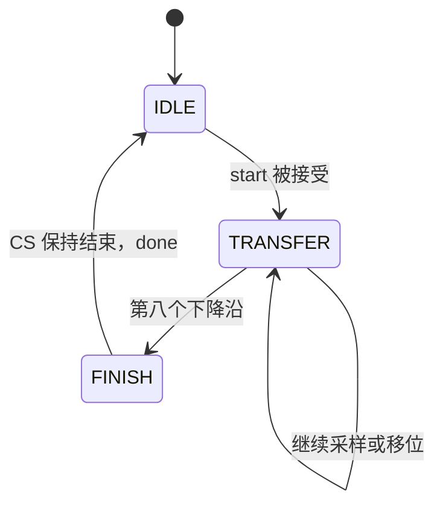

# 阶段一：同步 RTL 与 SPI Master（01–06）

工程基线：[RTL](../../lessons/01_spi_master/rtl/spi_master.sv)、[testbench](../../lessons/01_spi_master/tb/tb_spi_master.sv)、[接口讲义](../01_spi_master.md)。所有时间都以接受 start 的系统时钟上升沿为 t=0；表格描述理想 RTL 更新，不包括引脚传播延迟。

## 第 01 课内的基础入门顺序

SPI 是第一个完整项目。尚未系统学过数字 IC 时，先按下面的顺序拆解它的组成电路，再进入完整接口和波形。以下是第 01 课内的基础练习清单，不另设课号，不改变现有 SPI 规格；单独的微实验 RTL 尚未提供。

| 顺序 | 内容与练习 | 必须能解释什么 |
|---|---|---|
| 1 | 二进制、布尔逻辑、补码、位宽：解释 8'h80、8'hFF 和加法截断 | 相同位模式如何表示不同数值；溢出如何发生 |
| 2 | 组合 MUX、加法器、比较器与译码器：画输入到输出的电路 | 组合逻辑不保存状态；完整赋值为何避免 latch |
| 3 | DFF 与 8 位寄存器：加入 enable、同步低有效复位 | Q→MUX→D 的保持与更新，以及复位采样窗口 |
| 4 | 两个寄存器同拍更新：推演 a<=b、b<=a | 非阻塞赋值读取旧状态，与软件逐句执行的区别 |
| 5 | 计数器与终值使能：推演 0…24 的事件间隔 | 位宽、off-by-one 和 clock enable；所有寄存器仍由 clk 驱动 |
| 6 | 移位寄存器：逐拍发送 A5，接收独立的 3C | 串并转换、位序、旧值与最后一位的拼接 |
| 7 | FSM：画 IDLE/TRANSFER/FINISH 和 busy/done | 请求接受、忙时拒绝、有限结束和单周期完成 |
| 8 | testbench：先预测，再给独立输入并检查输出 | 如何发现错误；覆盖正常、边界和复位中止 |
| 9 | 连接完整 SPI Mode 0 Master，接下面的 01–06 | 首位提前准备、8 次采样、CS 尾部保持和结果有效时刻 |
| 10 | 接 07–10 的综合与 STA | RTL 如何映射成单元，setup/hold 与负载/PVT 的关系 |

基础练习与首次理解 SPI 建议预留 20–30 小时，计入基础课程原有时间预算；第 10 项按 07–10 的安排展开。组合过程通常用阻塞赋值，时序过程用非阻塞赋值，但学习重点是它们描述的电路和更新时刻。

从模拟背景出发，可把 DFF 理解为有 setup/hold 要求的状态采样元件，组合路径理解为有负载与 PVT 依赖的逻辑网络。数字抽象中的 0/1 和理想边沿便于推演，实际门延迟、斜率和亚稳态仍需对应时序与电路分析。

第一份学习产物：画带 enable 和同步复位的 8 位寄存器，列出 reset/enable/data 的优先级，手算三个 clk 边沿后的 Q；然后推演双寄存器交换。按“画电路→预测→写 RTL→独立仿真检查”推进，再阅读完整 SPI。

## 01：先把规格写成契约

### 目标和讲解

SPI 有移位功能，也有接口协议。Mode 0 表示 CPOL=0、CPHA=0：SCLK 空闲低，上升沿采样，下降沿准备下一位。全双工意味着 MOSI/MISO 在同一组时钟内同时传输。

模块接口必须决定何时接受数据。当前 Master 只有 IDLE 且 start=1 的系统时钟边沿才接受请求，并锁存 tx_data。忙时请求直接忽略，没有隐藏队列。start 要是一个 clk 周期的脉冲。

对于模拟工程师，接口契约相当于电路的工作条件：只说明“典型情况下能动”远远不够，还要给出输入有效窗口、异常行为和输出的使用时机。

| 事件 | 接受时刻/结果 | 需要调用方保证 |
|---|---|---|
| 发起传输 | IDLE 中 clk 上升沿 | start 单周期，tx_data 满足该边沿时序 |
| 传输期间改变 tx_data | 原交易继续 | 不把实时输入当成已接受数据 |
| busy 中再次 start | 丢弃 | 需要排队时由上层实现 |
| 第八次采样 | rx_data 更新 | 此时还没有 done |
| CS 释放 | done=1、busy=0 | 在 clk 域消费完成信号 |
| 同步复位采样为低 | 中止、回空闲、结果清零 | rst_n 低覆盖至少一个 clk 上升沿 |

消费方若同样用 `always_ff @(posedge clk)`，会在 done 置高后的下一个上升沿读到旧 done=1，同时读取已稳定的 rx_data；这是正常的寄存器间同步传输。

### 练习与验收

画出 start、busy、cs_n、done 的关系。补充一个反例：start 一直高到下一次 IDLE，会发生什么？验收要求能解释“发出请求”和“请求被接受”的区别，不把 busy-start 丢弃说成排队。

## 02：先预测 A5/3C 波形

### 目标和讲解

系统周期 20 ns，分频 D=25，所以半周期 H=D×20 ns=500 ns。接受请求后立即准备 MOSI[7]；第一采样沿在 H 之后出现。第 k 次采样位于 `(2k−1)H`，第 k 次下降沿位于 `2kH`，k=1…8；CS 释放位于 17H。

| k | 时间/μs | MOSI=A5 的采样值 | MISO=3C 的采样值 | bit_count |
|---|---:|---:|---:|---:|
| 1 | 0.5 | 1 | 0 | 0 |
| 2 | 1.5 | 0 | 0 | 1 |
| 3 | 2.5 | 1 | 1 | 2 |
| 4 | 3.5 | 0 | 1 | 3 |
| 5 | 4.5 | 0 | 1 | 4 |
| 6 | 5.5 | 1 | 1 | 5 |
| 7 | 6.5 | 0 | 0 | 6 |
| 8 | 7.5 | 1 | 0 | 7 |

第八次采样形成 3C；8.0 μs 出现最后下降沿；8.5 μs 释放 CS，done 高 20 ns。有效传输的八个时钟周期是 8 μs，CS 有效时间是 8.5 μs。

对应模拟电路的思考：数字波形图通常省略传播延迟和斜率，但真实接收器需要稳定窗口。RTL 中一条竖线不代表物理引脚在零时间内变化。

### 练习与验收

在 [现有 SVG](../../lessons/01_spi_master/results/sim/div25/spi_first_frame.svg) 上标出 t=0、八个上升沿、最后下降沿、done。产物目录若未收集，先按 [运行指南](../running.md#spi-master) 收集已有结果。用上表逐项对照，能说明为什么首位不需要先移位。

## 03：把 RTL 翻译成寄存器和门

### 目标和讲解

`always_ff @(posedge clk)` 描述寄存器。每个边沿，右侧表达式读取更新前的状态，非阻塞赋值安排新的 Q 值。它是并行的状态更新，不是软件逐句立即改变量。

```systemverilog
tx_shift <= {tx_shift[6:0], 1'b0};
mosi     <= tx_shift[6];
```

假设旧 tx_shift=A5，更新后 tx_shift=4A，mosi=旧 bit6=0。若错误地理解为先移位再取 bit6，会得到 1，丢失正确的下一位。

使能式寄存器的方程是 `Q_next = enable ? new_data : Q`。没有专用使能触发器时，可由 D 端 MUX 和普通 DFF 实现。“此周期保持”也有电路含义：反馈选择，而不是软件暂停。

`{rx_shift[6:0], miso}` 主要是连线重排；计数器的 `+1` 则会形成组合逻辑。FSM 的 case 会形成状态译码与选择网络。组合过程使用 `always_comb` 时，需要给所有输出完整赋值，否则可能推断 latch；时序过程有意保持 Q 不会因此推断 latch。

对模拟工程师而言，最有用的图是 Q→组合逻辑→D：Q 是当前状态，D 是下一状态，时钟决定采样时刻。

还要注意位宽与四态语义。8 位无符号计数从 FF 加 1，写回 8 位结果会截断成 00；中间表达式位宽、无尺寸常量和 signed/unsigned 混用可能产生不同的扩展与比较行为，所以写清位宽和符号。`8'h80` 按无符号数是 128，按有符号二进制补码是 −128。

仿真中的 X 表示未知，Z 表示高阻。普通 `==` 比较含未知位时可能返回 X；testbench 用 `!==` 将未知也判为不符合预期。它不能代替对硬件复位、初始化和真实三态结构的设计。组合逻辑一般用阻塞赋值表达临时计算，时序逻辑用非阻塞赋值描述状态更新。

### 练习与验收

画出 tx_shift、rx_shift、rx_data 和 mosi 的 D/Q 连线。推导第八次采样时，为什么 rx_data 要取 `{旧 rx_shift[6:0], miso}`，不能直接取旧 rx_shift。验收时不依赖逐句软件解释。

## 04：计数器、使能和状态机

### 目标和讲解

计数器从 0 数到 D−1，在命中终值的边沿执行一次“半周期事件”，随后清零。这些事件控制 SCLK 输出翻转，内部没有把 SCLK 当作寄存器时钟。

分频位宽是 `max(1, ceil(log2(D)))`。D=25 需要 5 位；D=1 仍保留合法的 1 位声明，每周期触发一次半周期事件。



FINISH 提供完整的末尾 CS 保持时间；它不是多余等待。bit_count 只在前七个下降沿增加，采样时依次为 0…7。

整数分频使 `f_sclk=50 MHz/(2D)`。要 2 MHz，需要 D=12.5，当前架构无法精确产生。D=12 为 2.0833 MHz，D=13 为 1.9231 MHz。交替半周期可以逼近平均频率，但会引入不同的边沿间隔，需要另写规格，不在本课加入。

### 练习与验收

计算 D=1、3、10、25 的频率、半周期和 CS 有效时间。D=10 可通过现有 runner 单独运行：

```powershell
ssh -T -o BatchMode=yes IC_Server "bash /home/userone/AAAIC/test_tb/digital_ic_learning/lessons/01_spi_master/scripts/run_sim.sh 10"
```

不需要修改默认 RTL 参数。D=10 结果位于独立 div10 目录，默认收集脚本仅收集 1、3、25；需要 div10 时单独 scp 下载并核对 SHA-256。验收要求预测频率与 3.4 μs CS 时间，再对照波形。

## 05：复位与边界行为

### 目标和讲解

同步低有效复位只有在 clk 上升沿才能更新寄存器。信号名 rst_n 的后缀表示极性，不表示异步；敏感列表和单元实现决定复位方式。

当前设计传输中复位会撤销 CS、清零 rx_data，不发 done。复位优先级高于 start。rst_n 的脉冲若完全落在两次 clk 上升沿之间，当前 RTL 不保证响应。

复位也是时序输入：同步复位必须满足 setup/hold；异步复位的释放需要考虑 recovery/removal。不要因为“复位很慢”就把所有复位路径 false path。

完成还有两个时刻：rx_data 在第八次采样更新，done 在 CS 释放时出现。二者之间的延迟用于完成协议尾部。上层用 done 作为有效标志，可以避免在中途读取旧交易结果。

### 练习与验收

列出复位和 start 同时出现、busy-start、第八次采样后复位、FINISH 中复位、复位后第一笔交易的行为。解释 done 为什么先默认清零、只在完成分支置高。能区分协议中止与正常完成。

## 06：用验证发现自己看不见的错误

### 目标和讲解

testbench 的独立从设备给出 MISO，同时检查 MOSI，不使用唯一的回环结果来证明收发正确。A5/3C 刻意让收发字节不同。256 个发送模式能覆盖每一位取值与排列，但仍不是对全部状态序列的穷尽证明。

| 检查 | 主要发现什么 |
|---|---|
| 256 个发送值，独立接收 | 位序、遗漏、收发耦合错误 |
| 接受后改变 tx_data | 未锁存输入 |
| busy 中再次 start | 非预期重启 |
| 8 升沿、8 降沿与间隔 | 计数 off-by-one、分频错误 |
| CS setup/hold | 首位准备和尾部结束错误 |
| reset abort + recovery | 中止时误发 done、残留状态 |
| done 单周期、总完成计数 | 重复完成或丢失完成 |
| 超时与非零退出 | 死锁及自动化漏判 |

现有 testbench 在 clk 上升沿后延迟 1 ns 检查输出，以观察非阻塞更新后的值。这个延迟是 testbench 的调度手段，不能移进可综合 RTL 当作真实延迟单元。

故障注入实验：保留当前改动后，一次只引入一个错误，例如把接受时的首位 MOSI 从 bit7 改为 bit6。运行测试，记录它在哪个检查点失败，再精确恢复这一行。不要以“仿真波形看起来差不多”代替自动检查。

### 练习与验收

写出至少两个注入错误与预计触发的检查。实验后恢复基线，执行 [运行指南](../running.md#spi-master) 中 sim→synth 流程。分频 1、3、25 必须各为 258 笔 PASS，总计 774 笔完整交易；脚本出现 `SPI_SIMULATION_COMPLETE`，综合出现完成标记并检查网表和约束。能解释为什么这些检查仍不等于形式等价或真实外部接口验证。

## 阶段验收

不看答案，从 A5/3C 手画完整时序；解释所有寄存器的更新时刻；准确计算分频；列出接口异常行为；给出至少一次预期失败与恢复通过的证据。答案见 [01–06 参考](07_answers.md)。

## 验证方法的按需补强

完成本课契约与独立 TB 后，使用 [K05 验证补充](../practice/verification.md) 练习 lint、SVA 采样、已知错误检测和覆盖闭环。基线设计/runner 保留；练习在独立副本进行，工具支持与实际结果另记。
