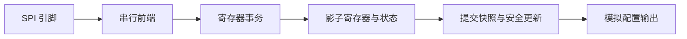

# 阶段四：集成与流控（16–18）

前提：能区分“已接收”“已跨域捕获”和“已应用到模拟配置”。本阶段组织模块边界；FIFO 和 APB 是扩展实验，先完成无队列的配置控制器，再按需求增加。

## 16：把协议、寄存器和模拟更新分开

### 目标和讲解

推荐分层：SPI 前端负责移位与帧格式；事务适配层产生地址/读写操作；寄存器层实现访问语义；更新控制层等待安全窗口；模拟侧接收 active 配置。

每个边界都定义 `valid/ready` 或“脉冲接受/忙时拒绝”。valid/ready 握手是在 clk 边沿二者同时为 1 时接受。valid=1 且 ready=0 时源必须保持 payload。脉冲加 busy 的方案则可能丢弃请求，两种协议不能混着解释。

寄存器属性：RW 可读写；RO 只读；W1C 写 1 清状态；写 1 触发操作的命令位可记为 W1P，读回固定 0。不要用软件写 0 清 sticky 事件，除非规格如此定义。

W1C 位发生“新事件”和“软件清除”同周期时必须指定优先级。推荐事件优先：`flag_next = (flag & ~clear) | event`，避免丢失同周期的新事件。

地址表要包含有效位、默认值、非法访问行为、原子范围和副作用。模拟电路尤其需要知道 active 的上电/复位状态、断使能含义以及生效时机，而不只是寄存器地址。

### 16 参考与实验

- **选读与定位**：K04 · P 接口方法：[EECS151 FPGA Lab 4：Ready-Valid Interfaces](https://eecs151.org/fpga/lab4/docs/pg3-readyvalid/)。来源/边界：[B151-F26](../references/berkeley_eecs151.md)。
- **带着问题读**：只读同域 valid/ready 的接受与保持；映射到 register_bank 的一次性副作用。
- **回到本课做**：配置项目练习：人为停顿请求，预测 W1C/commit 执行次数，再用事务台账防止重复写。
- **留下证据**：接口保持图、寄存器副作用次数与非法访问表。将预测、实际观察和结论写入 [本方向学习表](08_workbook.md)；公开资料引起的理解变化用 [学习日志模板](../learning_log/_template.md) 记录。

### 练习与验收

将第 23 节的地址表画到上述分层图上。分别推演非法地址、RO 写入、保留位写 1、W1C 与新事件并发、valid 等待的行为。验收要求所有异常有确定结果，适配器的 stall 不会导致重复写入。

## 17：FIFO 用来吸收什么

### 目标和讲解

FIFO 吸收短期生产/消费速率差，不能解决无限期平均生产速率大于消费速率。单条配置的无队列 busy-reject 是有效的简单设计；只有明确需要连续命令时才加 FIFO。

深度 N 的同步 FIFO 可以用读写指针与计数器表示状态：empty=(count=0)，full=(count=N)。接受写入使 count+1，接受读取使 count−1，同时接受则不变；指针分别推进。一次输入操作是否接受由握手定义，不能把请求直接当成计数更新。

本课选保守策略：empty 时同周期读写只接受写，不旁路新数据；full 时即使同周期读出，也拒绝写。该策略易于验证，可能损失一个边界周期的吞吐；若要边界同时读写优化，另写规格并考虑存储器 read-during-write 行为。

例子：8 条命令每 1 μs 到达一条，消费者每 2 μs 取一条，初始为空、第一次读取在 2 μs，并假设每次到达先入队、之后再执行同时间读取。瞬间峰值占用可达 5，而读取后的占用峰值是 4；深度必须按事件排序和接口接受语义计算，不能只看平均速率。

异步 FIFO 是另一种模块：读写域独立，常用 Gray 指针跨域、同步后的指针判断满/空，且 Gray 总线还需满足物理延迟/偏斜约束。同步 FIFO 的 count 不能直接跨域共用。

### 17 参考与实验

- **选读与定位**：K04/K09 · P 首选：[EECS151 FPGA Lab 4：FIFO](https://eecs151.org/fpga/lab4/docs/pg5-fifo/)。来源/边界：[B151-F26](../references/berkeley_eecs151.md)。
- **带着问题读**：只读 FIFO full/empty 与接口语义；FPGA 存储资源不等于 ASIC SRAM 宏。
- **回到本课做**：EXP-SRAM-BUFFER 前置：深度 4 reference queue 预测满空/同沿读写，随后比较同步 RAM 增加读延迟的后果。
- **留下证据**：队列 oracle、占用/接受表与 RAM 延迟契约。将预测、实际观察和结论写入 [本方向学习表](08_workbook.md)；公开资料引起的理解变化用 [学习日志模板](../learning_log/_template.md) 记录。

### 练习与验收

设计深度 4 的同步 FIFO，写出 empty/full、中间占用、同时读写、连续 overflow/underflow 的预期表。数据队列用独立参考模型检查顺序和无重复丢失。验收要求解释为什么加大 FIFO 仍无法支持永久超出消费速率的输入。

## 18：APB 适配器，可选扩展

### 目标和讲解

APB 是低带宽寄存器访问总线，不是学习数字 RTL 的前置条件。模拟配置常适合它，但当前 SPI 学习目标不需要为了总线而先加入处理器。

以含 PREADY/PSLVERR 的 APB 为教学对象：SETUP 周期 PSEL=1、PENABLE=0；下一周期进入 ACCESS，PENABLE=1。只有 ACCESS 中 PREADY=1 的采样边沿才完成传输，等待期间控制与写数据保持。

连续传输也要为下一笔访问经过 SETUP；不能把每个 PSEL 高的周期都解释成一次写入。PSLVERR 在完成的 ACCESS 周期有效，非法地址等行为需要上层规格定义。

| 状态 | PSEL | PENABLE | PREADY | 操作 |
|---|---:|---:|---:|---|
| 空闲 | 0 | 0 | 无关 | 不访问 |
| SETUP | 1 | 0 | 无关 | 保存/准备地址与控制 |
| ACCESS 等待 | 1 | 1 | 0 | 维持同一事务 |
| ACCESS 完成 | 1 | 1 | 1 | 读结果有效或一次写入 |

适配器向寄存器层只发一次实际操作，不在等待周期重复执行 commit/W1C。可以选择“更新队列满时 APB 等待”，或“立即完成总线访问但状态报告 busy-reject”；需要解释总线完成与模拟应用完成的区别。

### 18 参考与实验

- **选读与定位**：K04 · O 接口类比：[EECS151 FPGA Lab 4：Ready-Valid Interfaces](https://eecs151.org/fpga/lab4/docs/pg3-readyvalid/)。来源/边界：[B151-F26](../references/berkeley_eecs151.md)。
- **带着问题读**：只比较“接受条件”，不把 ready-valid 页当作 APB 规范；本课 PSEL/PENABLE/PREADY 时序保持独立。
- **回到本课做**：APB 选修：画两个 wait cycle 后完成的写，注入重复 commit，检查 ACCESS 完成仅一次副作用。
- **留下证据**：APB 状态波形与总线完成/模拟应用的事件对照。将预测、实际观察和结论写入 [本方向学习表](08_workbook.md)；公开资料引起的理解变化用 [学习日志模板](../learning_log/_template.md) 记录。

### 练习与验收

手画一笔带两个等待周期的写入和连续两笔访问。用测试验证 commit 副作用只发生一次。完成本课只需接口推演；若实现 APB 模块，另建后续实验目录及独立 testbench，不扩展第 01 课 Master。

## 阶段验收

完成地址表和事务接口；给出 FIFO 满空的接受规则；APB 选做，但至少读懂等待状态。答案见 [16–18 参考](07_answers.md)。

## FIFO 实现的下一步

需要扩大历史/样本缓冲时，使用 [K09 RAM/SRAM 练习](../practice/memory.md)，先定义同步读延迟、同址冲突与初始化，再考虑宏视图。存储实现改变后要重新审查预取、输出 valid 和原 FIFO 接受规则。
