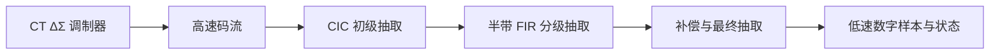

# CT ΔΣ ADC 后级数字滤波课程

版本：2026-10-03。学习者已有 CT ΔΣ ADC 环路滤波器设计经验。本专题连接 STF/NTF、噪声整形与多速率数字实现，作为 [数模混合控制课程](../mixed_signal/00_course.md) 的独立支线。

## 学习目标

能从信号/噪声指标设计抽取链，分析每一级的频谱折叠、通带误差与延迟；能建立浮点和 bit-accurate 定点模型，并将它实现成可验证的 RTL。能区分后级滤波、调制器性能、模拟抗混叠和时钟/CDC 的证据。

后级滤波处理已采样的调制器输出。它保留带内信号、抑制带外噪声并降低数据率，通常不改变调制器本身的环路稳定性；若把处理结果反馈回模拟环路，则需要另行分析完整闭环。

## 前置与学习顺序

数学/浮点部分 DF01–DF06 可以现在开始。进入 RTL 前，先完成基础课 [01–06 同步 RTL](../course/01_sync_spi.md)、[07–10 综合/时序](../course/02_synth_sta.md) 和专项 [33–35 定点/平均](../mixed_signal/03_fixed_point.md)。不需要先学完全部 48 节控制课。

专题编号 DF01–DF08，保留原 48 节编号。建议 40–70 小时，按每周 6–8 小时约 5–12 周；含模型、实验和 RTL 调试。先做频谱与浮点，再定点，最后 RTL。

## 八课目录

课号链接直接进入该课“参考与实验”：在原知识点旁选择具体官方阅读，带着问题回来完成原练习，再记录证据。P/S/O 表示首选/第二视角/可选，Own 保留本项目专属契约。

| 编号 | 内容 | 动手产物 | 推进门槛 |
|---|---|---|---|
| [DF01](01_spectrum.md#df01-参考与实验) | 调制器输出、PSD、STF/NTF | 频谱及测量口径表 | 单位、窗、带宽与模型假设明确 |
| [DF02](02_fir.md#df02-参考与实验) | 离散时间、卷积与 FIR | 直接卷积模型及频响 | 解释 DC 增益、零点和群延迟 |
| [DF03](03_decimation.md#df03-参考与实验) | 抽取、混叠和抗混叠预算 | 折叠图及错误实验 | 证明后级无法消除已折回的噪声 |
| [DF04](04_cic.md#df04-参考与实验) | CIC/sinc 结构、增益和溢出 | 等效 FIR 与 modulo 模型 | 幅度、相位、位宽都一致 |
| [DF05](05_multistage.md#df05-参考与实验) | 半带、多级与多相 | 每级频率/计算预算 | 用输入 PSD 审查各级折叠 |
| [DF06](06_budget.md#df06-参考与实验) | 补偿、噪声和延迟 | 整链指标与系数设计记录 | 指标由数值分析确认 |
| [DF07](07_fixed_point.md#df07-参考与实验) | 系数、位宽、舍入和定点误差 | bit-accurate 模型 | 极值正确，误差满足目标 |
| [DF08](08_rtl.md#df08-参考与实验) | 单时钟 RTL、valid、验证与综合 | 逐样本比对和实现报告 | 数值与协议均可复现 |

另有 [结课项目规格](09_project.md)、[参考答案](10_answers.md)、[实验记录与参数入口](11_workbook.md)。这是完整教学材料与待实现实验设计，不是已经完成的抽取器或系数集。

## 统一教学案例

| 参数 | 教学值 | 边界 |
|---|---:|---|
| 调制器输出采样率 f_mod | 6.144 MHz | 示例，待替换实际参数 |
| 信号带宽 BW | 20 kHz | 带内积分和 passband 使用此值 |
| 最终输出率 f_out | 48 ksample/s | Nyquist 为 24 kHz |
| 总抽取倍率 R_total | 128 | f_mod/f_out |
| OSR | 153.6 | f_mod/(2BW)，不等于 R_total |
| 接口码流 | 1 bit：0→−1，1→+1 | signed 数值表示至少 2 位 |
| 示范正弦 | 峰值 0.5，3 kHz | 归一化峰值 1 为输入满量程 |
| 候选链 | CIC3/16→HB/2→HB/2→补偿 FIR/2 | 候选，尚未证明满足全部指标 |

实际调制器阶数、NTF、量化器位数和实测码流尚未提供，不据此承诺 ADC 的 SNR/ENOB。三阶 NTF=(1−z⁻¹)³ 仅用于线性化噪声整形练习；这不等于某个真实 CT 三阶调制器，更不是稳定的完整调制器实现。

浮点实验分三类：确定性正弦/噪声研究混叠；线性化 STF/NTF 研究预算；合法二电平码流研究定点/RTL。前两类一般不是单比特码流，不能直接量化成 0/1 后声称仍为同一模型。真实码流或明确的离散调制器模型用于 ADC 性能相关练习。

## 四个实验里程碑

F1：直接抽取与低通后抽取的对照，包含一个带外正弦折入带内的反例。

F2：CIC 频响、增益、延迟和 modulo 运算与等效 FIR 一致。

F3：整链浮点及定点模型，给出 coefficient、量化、噪声、alias 与延迟预算。

F4：RTL 逐样本、逐版本一致，输出计数/复位/启动/overflow 正确，综合结构与时序来源明确。

## 环境与实现约定

算法实验优先使用已有 Python/NumPy/SciPy 或 MATLAB 环境；没有相应环境时先做手算和伪代码，使用项目内或已有运行时，不安装系统包或改全局 PATH。系数设计方法、工具版本和参数进入记录，生成报告/图形/码流放 Git 忽略的 results。

RTL 教学项目单独采用 clk_core=49.152 MHz，输入每 8 个 core 周期接受一个样本，精确得到 6.144 MHz。当前 SPI 第一课的 50 MHz 和单系统时钟契约保持不变。50 MHz 不能用固定整数使能间隔精确产生此采样率；异步实际调制器接口要单独设计 CDC。

不在学习曲线里提前加入可运行时改系数或动态倍率；首版系数和倍率在构建时固定。SPI 配置/读回是集成扩展，持续结果流的数据吞吐必须另算。

先阅读 [进度记录](../progress.md)。Icarus/Genus 使用独立 batch job；不改现有 GUI/服务。新抽取项目使用自己的测试、完成标记和综合脚本，不借第一课 PASS。教程库只提供逻辑教学模型，RTL 仿真不等于形式等价、真实 ADC 性能或工艺签核。

## 第一次任务

先做 DF01：统一码流编码、FS、采样率和 PSD 单位；用 3 kHz 正弦校验 FFT。随后做 DF03 的 47 kHz→1 kHz 混叠实验，再进入滤波器设计。

相关 [ADC 内部数字模块专题](../adc_digital/00_course.md)覆盖多比特反馈DEM及TI样本/校准。DEM位于反馈环路并改变延迟与失配频谱，后级抽取位于输出通路；两者不能混作同一个滤波模块。

## 外部资料怎样服务抽取项目

滤波与频谱仍由本专题主导（K16）；RTL/流水/存储/实现方法查 [Mapping](../references/course_mapping.md)，不把数字课当作抽取理论首选。理解变化写 [日志](../learning_log/README.md)，验收仍在本专题 workbook。
